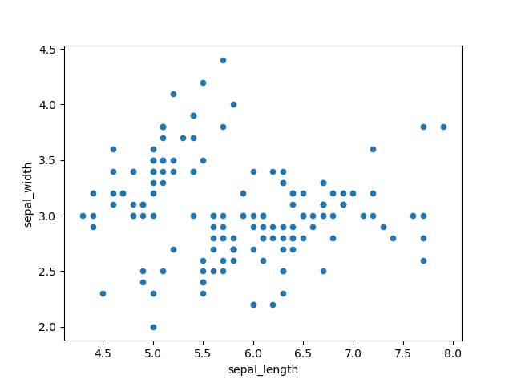
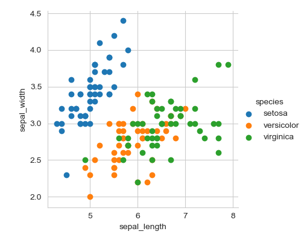
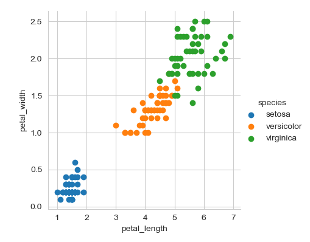

# Project 2019
This repositery contains (Iris Data Set) project 2019 for the Module "Programming and Scripting" of Higher Dip. in Data Analytics at GMIT.by Freha Saleem
-----
The aim of this project is to research the iris data set, and  write documentation and code in the Python programming language based on that research.
---------
## Lecturer: Dr Ian McLoughlin

# Background Information
-----
## Iris Flower Data Set
<<<<<<< HEAD

=======


>>>>>>> 5df2a090536272785bb1cb5bce3a67424a178fd5

<p  align="justify">The Iris flower data set or Fisher's Iris data set is a multivariate data set introduced by the British statistician and biologist Ronald Fisher in his 1936 paper "The use of multiple measurements in taxonomic problems" as an example of linear discriminant analysis. 
This dataset sometimes called Anderson's Iris data set because Edgar Anderson collected the data to quantify the morphologic variation of Iris flowers of three related species. Two of the three species were collected in the Gaspé Peninsula "all from the same pasture and picked on the same day and measured at the same time by the same person with the same apparatus". </p>
<p  align="justify">
The data set consists of 50 samples from each of three species of Iris (Iris setosa, Iris virginica and Iris versicolor).
Four features: sepal length, sepal width, petal length and petal width (meaurements in centimeters) for each flower. Based on the combination of these four features, Fisher developed a linear discriminant model to distinguish the species from each other.</p>
-
Dataset Link : https://archive.ics.uci.edu/ml/machine-learning-databases/iris/iris.data

<<<<<<< HEAD
# Data Analysis Process


<h2>Description</h2>
=======
<h2>Summery</h2>
>>>>>>> 5df2a090536272785bb1cb5bce3a67424a178fd5
This dataset consist of 150 rows of data and 5 columns 

| sepal_length  | sepal_width  | petal_length | petal_width | species  |
| :-----------: | :----------: | :----------: | :---------: | :------: |
|               |              |              |             |          |

There are 3 classes (types/species) and 4 predictors (variables/attributes) 
<h3>Species(classes)</h3>
    
    1. Setosa    
    2. Virginica 
    3. versicolor

<h3>Attributes</h3>

    1. sepal_length (in cm)
    2. sepal_width  (in cm)
    3. petal_length (in cm)
    4. petal_width (in cm) 
    
# Data Analysis Process
    
When looking at the data analysis i come across this diagram it is explaining the whole process of data anlysis. I used Ms Word to draw it. as In this project data is already collected therefore  I only download that data from the data source *link is given above*. 


I start from seond phase that is Exploration of data.

# Import Python Libraries for Data Analysis
    
    import pandas as pd    
    import numpy as np
    import matplotlib.pyplot as plt
    import seaborn as sns
<<<<<<< HEAD
   
    * Pandas:
         pandas is an open source, BSD-licensed library providing high-performance, easy-to-use data structures and data analysis tools for the Python programming language. pandas is a NumFOCUS sponsored project.
            [source: https://pandas.pydata.org/]
=======
>>>>>>> 5df2a090536272785bb1cb5bce3a67424a178fd5
    
- **pandas**
        is an open source, BSD-licensed library providing high-performance, easy-to-use data structures and data analysis tools for the Python programming language. pandas is a NumFOCUS sponsored project.
            [source: https://pandas.pydata.org/] 
            Pandas is the most popular data manipulation package in Python, and DataFrames are the Pandas data type for storing tabular 2D data.
 
- **numpy**
        is the fundamental package for scientific computing with Python. 
    
- **matplotlib**
        is a Python 2D plotting library which produces publication quality figures in a variety of hardcopy formats and interactive environments across platforms. Matplotlib can be used in Python scripts, the Python and IPython shells, the Jupyter notebook, web application servers, and four graphical user interface toolkits.[source: https://matplotlib.org/]
    
- **seaborn**
        is a Python data visualization library based on matplotlib. It provides a high-level interface for drawing attractive and informative statistical graphics. [source: https://seaborn.pydata.org/]
    
   
# Read Data
  First download the datset csv file from the 
Dataset Link : https://archive.ics.uci.edu/ml/machine-learning-databases/iris/iris.data and save it in the project folder as iris.cvs.
    
*( CSV is a simple file format used to store tabular data. CSV (comma-separated value) file format is common for transferring and storing data. The ability to read, manipulate, and write data to and from CSV files using Python is a key skill for any data scientist or business analysis.)*
   
  Read data from file 'iris.csv'into pandas DataFrames
  ```
   dataset = pd.read_csv("iris.csv")
   ```  
   Print the name of columns (headings)
   ``` 
    dataset.columns
    
   ```
# Exploratory Data Analysis(EDA)
   
 for Exploratory Data Analysis we use descriptive statistics and graphs. 
 it allows to:
    1. Better understand the data
    2. Build an intuition about the data
The number of data points and number of columns/features
```
print(dataset.shape)
(150,5)
```
There is not any value null in data set
   ``` 
     dataset.isnull().any()
   ```
It is a balanced dataset. The number of observations is same for all the classes in the dataset.
        
        dataset["species"].value_counts()
    
        50 rows for each species
    
   
    
    Information about dataset
    
        dataset.info()
    

# Visualisation
    Patterns
    First 2D scatter graph was drawn of the data set with sepal length and sepal width 
   
    <p>than colour coded graph was drawn as it is clear from the image data of stosa flowers is seprable from others</p>
    
    <p>Next colour coded 2d scatter graph of petal width and length shows the same that the dat of stosa is clearly seprable.</p>
    
    <p>The best tool to identify the outliers is the box plot.</p>
# Reference
    Python Pandas read_csv – Load Data from CSV Files [https://www.shanelynn.ie/python-pandas-read_csv-load-data-from-csv-files/]
    Iris datset-Exploratory Data Analysis [https://www.kaggle.com/lalitharajesh/iris-dataset-exploratory-data-analysis]
    Iris Data Visualization [https://www.kaggle.com/kstaud85/iris-data-visualization]
    Visualize Iris dataset using Python [http://www.learn4master.com/machine-learning/visualize-iris-dataset-using-python]
