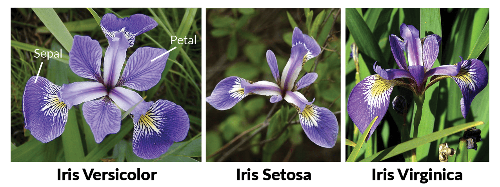

# Project 2019
This repositery contains (Iris Data Set) project 2019 for the Module
Programming and Scripting at GMIT.@Freha
---
# Iris Data Set

The Iris flower data set or Fisher's Iris data set is a multivariate data set introduced by the British statistician and biologist Ronald Fisher in his 1936 paper. The use of multiple measurements in taxonomic problems as an example of linear discriminant analysis.It is sometimes called Anderson's Iris data set because Edgar Anderson collected the data to quantify the morphologic variation of Iris flowers of three related species. Two of the three species were collected in the Gaspé Peninsula "all from the same pasture and picked on the same day and measured at the same time by the same person with the same apparatus".

The data set consists of 50 samples from each of three species of Iris (Iris setosa, Iris virginica and Iris versicolor). Four features were measured from each sample: the length and the width of the sepals and petals, in centimeters. Based on the combination of these four features, Fisher developed a linear discriminant model to distinguish the species from each other.

Dataset Link : https://archive.ics.uci.edu/ml/machine-learning-databases/iris/iris.data

<h2>Description</h2>
This dataset consist of 150 rows of data and 5 columns

<table>| sepal_length | sepal_width | petal_length | petal_width  | species|</table>

there are 4 predictors(variables/attributes) and 3 classes(types/species)

<h3>attributes</h3>

    1. sepal_length (in cm)
    2. sepal_width
    3. petal_length
    4. petal_width  

    | species   |
    |-----------|
    | setosa    |
    | verginica |
    | versicolor|

#Exploratory Data Analysis(EDA)
    EDA allows to:
    1. Better understand the data
    2. Build an intuition about the data
    It is a balanced dataset
# Visualisation
    Patterns
    First 2D scatter graph was drawn of the data set with sepal length and sepal width 
   
    
than colour coded graph was drawn as it is clear from the image data of stosa flowers is seprable from others

    
    
Next colour coded 2d scatter graph of petal width and length shows the same that the dat of stosa is clearly seprable.

    