# Project 2019
## Module:Programming and Scripting
## Course: H.Dip. in Data Analytics
## Lecturer: Dr Ian McLoughlin

# Table of Contents <a name="Table"></a>
1. [Introduction](#introduction)
   - [Objective](#objective)
   - [Project Plan](#plan)
   - [Technology Used](#technology)
2. [Bacground Information](#background)
   - [Iris Flower Data Set](#dataset)
   - [Ronald Fisher](#ronald)
   - [Linear Discriminant Analysis](#LDA)
   - [Summery of Data Set](#summery)
3. [Exploratry Data Analysis](#analysis)
   - [Python Libraries](#library)
   - [Read Data](#read)
   - [Insight of Data Set](#insight)
   - [Visualization](#visual)
      - [Histogram](#hist)
      - [Boxplot](#box)
      - [Violin plot](#violin)
      - [pairsplot](#pair)
      - [2D Scatter Graph](#scatter)
4. [Conclusion](#conclusion)
5. [Reference](#Reference)
  

# 1. Introduction <a name="introduction"></a>
This repositery contains all files and folders of my submissions for (Iris Flower Dataset) project 2019. This project is part of assessment for Module "Programming and Scripting" at GMIT.
## Objective<a name="objective"></a>
The aim of this project is to research the Iris Flower Data Set, and  write documentation and code in the Python programming language based on that research.

The Problem statement of this project is as follows
 1. Research background information about the data set and write a summary about it.
 2. Keep a list of references you used in completing the project.
 3. Download the data set and write some Python code to investigate it.
 4. Summarise the data set by, for example, calculating the maximum, minimum and mean of each column of the data set. A Python script will quickly do this for you.
 5. Write a summary of your investigations.
 6. Include supporting tables and graphics as you deem necessary.

## Project Plan <a name="plan"></a>
- **Research**<br>
   Use online resources (kaggale,pandas,moodle etc) to research the Dataset and learn about new libraries using to complete the project. 
- **Create a Github Repository**<br>
   Create a github repository and start editing readme.md
- **Make a List of the Project Requirements**<br>
   Make a list of objective in the word file and create project folder on my computer and link it with my repository.
- **Look into other option for coding in python other than Visual Studio Code**<br>
   I use Jupyter notebook for this project also as it is so easy to make changes and debug the project in it.
- **Time Management**<br>
   As I am new to Python Programming, github and data analysis so I set myself to spend at least 6 hours every week on this project.

## Technology Used <a name="technology"></a>
- Jupyter notebook
- python 3.0
- Visual Studio Code
- Github
- pandas ,seaborn,numpy and matplotlib libraries


# Background Information <a name="background"></a>
-----
## Iris Flower Data Set <a name="dataset"></a>

<center></center>

<p  align="justify">The Iris flower data set or Fisher's Iris data set is a multivariate data set introduced by the British statistician and biologist Ronald Fisher in his 1936 paper "The use of multiple measurements in taxonomic problems" as an example of linear discriminant analysis. 
This dataset sometimes called Anderson's Iris data set because Edgar Anderson collected the data to quantify the morphologic variation of Iris flowers of three related species. Two of the three species were collected in the Gaspé Peninsula "all from the same pasture and picked on the same day and measured at the same time by the same person with the same apparatus". </p>
<p  align="justify">
The data set consists of 50 samples from each of three species of Iris (Iris setosa, Iris virginica and Iris versicolor).
Four features: sepal length, sepal width, petal length and petal width (meaurements in centimeters) for each flower. Based on the combination of these four features, Fisher developed a linear discriminant model to distinguish the species from each other.</p>
-
Dataset Link : https://archive.ics.uci.edu/ml/machine-learning-databases/iris/iris.data

## Ronald Fisher <a name="ronald"></a>

   <center></center>

<p>Sir Ronald Aylmer Fisher, byname R.A. Fisher, (born February 17, 1890, London, England—died July 29, 1962, Adelaide, Australia), British statistician and geneticist who pioneered the application of statistical procedures to the design of scientific experiments.</p>
For his work in statistics, he has been described as "a genius who almost single-handedly created the foundations for modern statistical science" and "the single most important figure in 20th century statistics".<br>
source:[https://en.wikipedia.org/wiki/Ronald_Fisher]

## Liner Discriminant Analysis <a name="LDA"></a>
Linear discriminant analysis (LDA),  is a generalization of Fisher's linear discriminant, a method used in statistics, pattern recognition and machine learning.

The purpose of LDA is to classify objects into groups based on a set of features that describe the objects. In general, an object is placed into one of a number of predetermined groups based on observations made on that object. 
source: [https://rstudio-pubs-static.s3.amazonaws.com/386394_19c4d87014ec4d8c81d26bb1f8090bf7.html]

Applying this description to the iris data set - the groups are the 3 iris species (Iris Setosa, Iris Versicolor or Iris Virginica), the set of features would be the petal length, petal width, sepal length and sepal width. 

## Summery of DataSet <a name="summery"></a>

**This dataset consist of 150 rows of data in 5 columns** 

    | sepal_length  | sepal_width  | petal_length | petal_width | species  |
    | :-----------: | :----------: | :----------: | :---------: | :------: |
    |               |              |              |             |          |

**There are 3 classes (types/species) and 4 predictors (variables/attributes) in this data set**
        
   **Species(classes)**<br>
    
         1. Setosa    
         2. Virginica 
         3. versicolor

   **Attributes**

        1. sepal_length (in cm)
        2. sepal_width  (in cm)
        3. petal_length (in cm)
        4. petal_width (in cm) 
    
# Exploratory Data Analysis(EDA) <a name="analysis"></a>
   
   Exploratory Data Analysis is an approach/philosophy for data analysis that employs a variety of techniques to:

    1. Better understand the data
    2. Build an intuition about the data

I am using python programming as a tool to explore the data and using its different libraries to get descriptive statistics and graph.
## Python Libraries <a name="library"></a>
Import following libraries in program
    
    import pandas as pd    
    import numpy as np
    import matplotlib.pyplot as plt
    import seaborn as sns
    
- **pandas**
        is an open source, BSD-licensed library providing high-performance, easy-to-use data structures and data analysis tools for the Python programming language. pandas is a NumFOCUS sponsored project.
            [source: https://pandas.pydata.org/] 
            Pandas is the most popular data manipulation package in Python, and DataFrames are the Pandas data type for storing tabular 2D data.
 
- **numpy**
        is the fundamental package for scientific computing with Python. 
    
- **matplotlib**
        is a Python 2D plotting library which produces publication quality figures in a variety of hardcopy formats and interactive environments across platforms. Matplotlib can be used in Python scripts, the Python and IPython shells, the Jupyter notebook, web application servers, and four graphical user interface toolkits.[source: https://matplotlib.org/]
    
- **seaborn**
        is a Python data visualization library based on matplotlib. It provides a high-level interface for drawing attractive and informative statistical graphics. [source: https://seaborn.pydata.org/]
    
   
## Read Data <a name="read"></a>
  First download the datset csv file from the 
Dataset Link : https://archive.ics.uci.edu/ml/machine-learning-databases/iris/iris.data and save it in the project folder as iris.cvs.

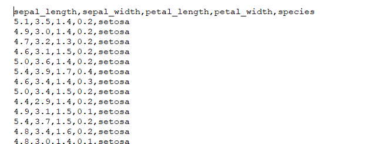
    
*( CSV is a simple file format used to store tabular data. CSV (comma-separated value) file format is common for transferring and storing data. The ability to read, manipulate, and write data to and from CSV files using Python is a key skill for any data scientist or business analysis.)*
   
Read data from file 'iris.csv'into pandas DataFrames
  ```python
   dataset = pd.read_csv("iris.csv")
   ```  
Print the name of columns (headings)
   ```python 
    dataset.columns 
   ```
   


## Insight into Dataset <a name="insight"></a>

- The number of data points and number of columns/features
   ```python
     print(dataset.shape)
   ```
    (150,5)

- There is not any null value in data set *check if there is any empty cell*
   ```python 
     print(dataset.isnull().any())
   ```
   

- It is a **balanced dataset**. The number of observations is same for all the classes in the dataset.
   ```python   
     print(dataset["species"].value_counts())
   ```
   
   
    50 rows for each species

- Information about dataset
   ```python
     print(dataset.info()) 
   ```
   

- First 10 rows of data set
   ```python
      print(dataset.head(10)) 
   ```
   
 
- Statistics summery of dataset
   ```python
     print(dataset.describe()) 
   ```
    

- Statistics summery of dataset of three species seprately
<details><summary>PYTHON CODE</summary>
   <p>

   ```python
     #Create 3 DataFrame for each Species
     setosa=dataset[dataset['species']=='setosa']
     versicolor =dataset[dataset['species']=='versicolor']
     virginica =dataset[dataset['species']=='virginica']
     print("information of 3 species data sets")
     print("Descriptive statistics of Setosa")
     print(setosa.describe().round(3))
     print("Descriptive statistics of versicolor")
     print(versicolor.describe().round(3))
     print("Descriptive statistics of virginica")
     print(virginica.describe().round (3))
   ```
   </p>
   </details>

   

   

   
    
# Visualisation of Dataset <a name="visual"></a>
## Histogram <a name="hist"></a>

   <p align="justify"> A histogram is a great tool for quickly assessing a probability distribution that is  understood by almost any audience. Python offers a handful of different options for building and plotting histograms. Most people know a histogram by its graphical representation, which is similar to a bar graph.</p>

### Sepal Length Histogram for the Iris Dataset
   <details><summary>PYTHON CODE</summary>
   <p>

   ```python
   # sepal length histogram for the dataset
   plt.figure() 
   x = dataset["sepal_length"]
   plt.hist(x, bins = 20, color = "blue") 
   plt.title("Sepal Length in cm") 
   plt.xlabel("Sepal Length (cm)") 
   plt.ylabel("Count") 
   plt.show()
   ```
   </p>
   </details>


### Sepal Width Histogram for the Iris Dataset
   <details><summary>PYTHON CODE</summary>
   <p>

   ```python
   # sepal width histogram for the dataset
   plt.figure() 
   x = dataset["sepal_width"] 
   plt.hist(x, bins = 20, color = "blue") 
   plt.title("Sepal Widthh in cm") 
   plt.xlabel("Sepal Width (cm)") 
   plt.ylabel("Count") 
   plt.show()
   ```
   </p>
   </details>

   
### Sepal Length Histogram for the Iris Dataset
   <details><summary>PYTHON CODE</summary>
   <p>

   ```python
   #petal length histogram for the dataset
   plt.figure()
   x = dataset["petal_length"]   
   plt.hist(x, bins = 20, color = "blue") 
   plt.title("Petal Length in cm") 
   plt.xlabel("Petal_Length_cm") 
   plt.ylabel("Count") 
   plt.show()

   ```
   </p>
   </details>

   
   ### Sepal Length Histogram for the Iris Dataset
   <details><summary>PYTHON CODE</summary>
   <p>

   ```python
   #petal width histogram for the dataset
   plt.figure() 
   x = dataset["petal_width"]  
   plt.hist(x, bins = 20, color = "blue") 
   plt.title("Petal Width in cm") 
   plt.xlabel("Petal_width_cm") 
   plt.ylabel("Count") 
   plt.show()
   ```
   </p>
   </details>

   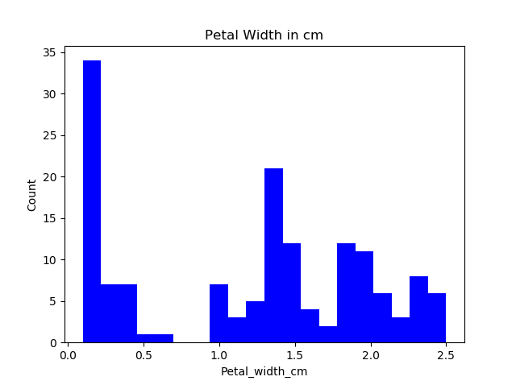

   ```
    # histogram for all 4 variables of data set
      dataset.hist()
      plt.show()
   ```


## BoxPlot <a name="box"></a>
   
<p align="justify"> Boxplot (box and wisker graph) is probably one of the most common type of graphic. A boxplot is a standardized way of displaying the distribution of data based on a five number summary (“minimum”, first quartile (Q1), median, third quartile (Q3), and “maximum”).
It can tell you about your outliers and what their values are. It can also tell you if your data is symmetrical, how tightly your data is grouped, and if and how your data is skewed.</p>
The line that divides the box into 2 parts represents the **median** of the data. The end of the box shows **the upper and lower quartiles**. The extreme lines shows **the highest and lowest value excluding outliers**. Note that boxplot hide the number of values existing behind the variable. 
<p>The best tool to identify the outliers is the box plot.</p>

    
&amp&amp&amp

    Source:https://flowingdata.com/2008/02/15/how-to-read-and-use-a-box-and-whisker-plot/
### Boxplot of whole data set

 ```python
   plt.figure()
   dataset.boxplot()
   plt.show()
  ```
  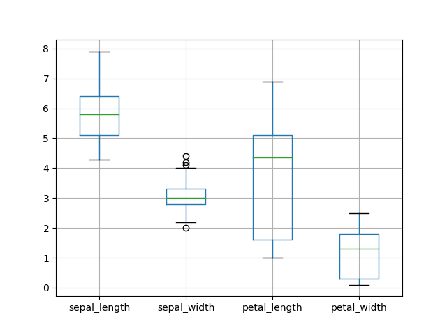

### Box plot of all varients grouped by species

  ```python
   dataset.boxplot(by="species", figsize=(7,7))
   plt.show()
  ```

### Boxplots
### Petal Length Boxplot group by species
   <details><summary>PYTHON CODE</summary>
   <p>

  ```python
   # petal length boxplot group by species
   plt.figure()
   sns.boxplot(x="species", y="petal_length", data=dataset)
   plt.show()
  ```
  </p>
  </details>

   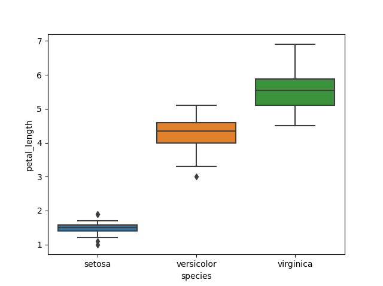

   ### Petal Width Boxplot group by Species
   <details><summary>PYTHON CODE</summary>
   <p>
   
  ```python
   # petal width boxplot graph group by species
   plt.figure()
   sns.boxplot(x="species", y="petal_width", data=dataset)
   plt.show()
  ```
  </p>
  </details>

   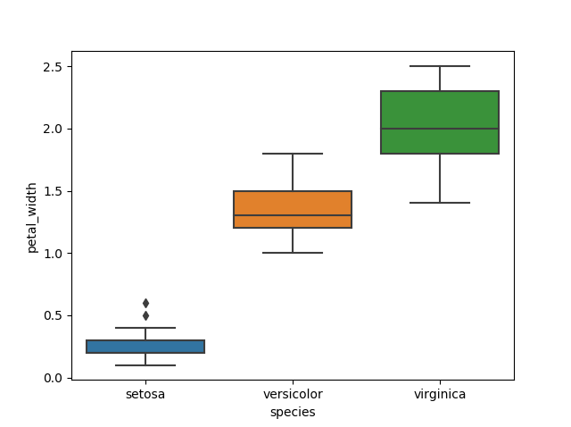

### Sepal Length Boxplot group by Species
   <details><summary>PYTHON CODE</summary>
   <p>

  ```python
   # sepal length boxplot group by species
   plt.figure()
   sns.boxplot(x="species", y="sepal_length", data=dataset)
   plt.show()
  ```
  </p>
  </details>

   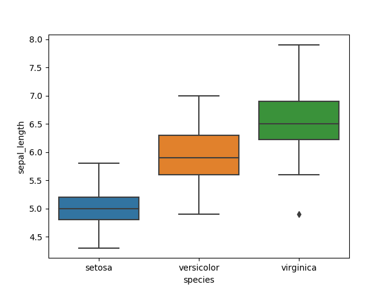

### Sepal Width Boxplot group by Species
   <details><summary>PYTHON CODE</summary>
   <p>
   
  ```python
   # sepal width boxplot graph group by species
   plt.figure()
   sns.boxplot(x="species", y="sepal_width", data=dataset)
   plt.show()
  ```
  </p>
  </details>

   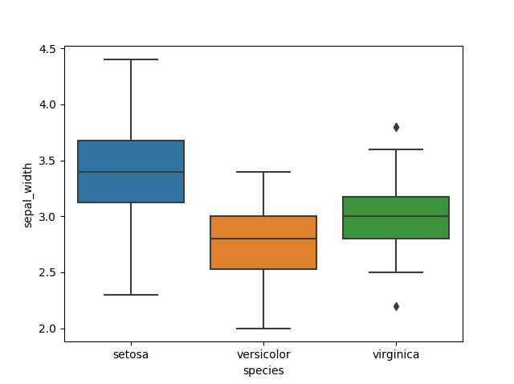

## Boxplot with data points

    
 ``` python   
     plt.figure(figsize = (10, 7)) 
     ax= sns.boxplot(x="species", y="petal_length", data=dataset)
     ax= sns.stripplot(x="species", y="petal_length", data=dataset, jitter=True, edgecolor="gray")
     boxtwo = ax.artists[2]
     boxtwo.set_facecolor('red')
     boxtwo.set_edgecolor('black')
     boxthree=ax.artists[1]
     boxthree.set_facecolor('yellow')
     boxthree.set_edgecolor('black')
     plt.show()
   ```

   
## Violin plots <a name="violin"></a>
   <p align="justify"> plays a similar role as a box and whisker plot. It shows the distribution of quantitative data across several levels of one (or more) categorical variables such that those distributions can be compared. Unlike a box plot, in which all of the plot components correspond to actual datapoints, the violin plot features a kernel density estimation of the underlying distribution. source:https://seaborn.pydata.org/generated/seaborn.violinplot.html </p>
   <p>Here we are using violin plot to visualise the distribution of the data and its probability density. The white dot is the median.</p>

   ```python
   #sepal width violin plot
   fig, ax = plt.subplots(figsize =(9, 7)) 
   sns.violinplot(ax = ax, x = dataset["species"],y = dataset["sepal_width"] ) 
   plt.show()
   ```
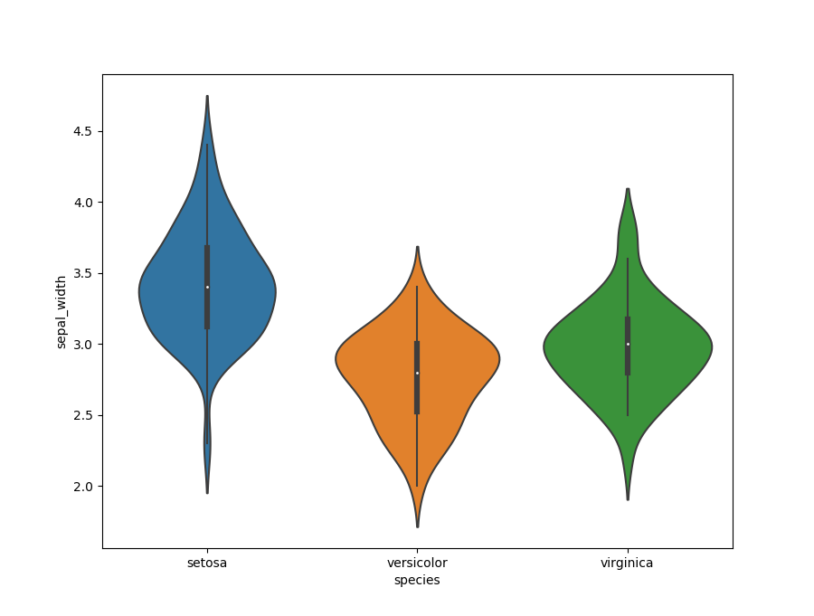
   ```python
   #sepal length violin plot
   fig, ax = plt.subplots(figsize =(9, 7)) 
   sns.violinplot(ax = ax, x = dataset["species"],y = dataset["sepal_length"] ) 
   plt.show()
   ```
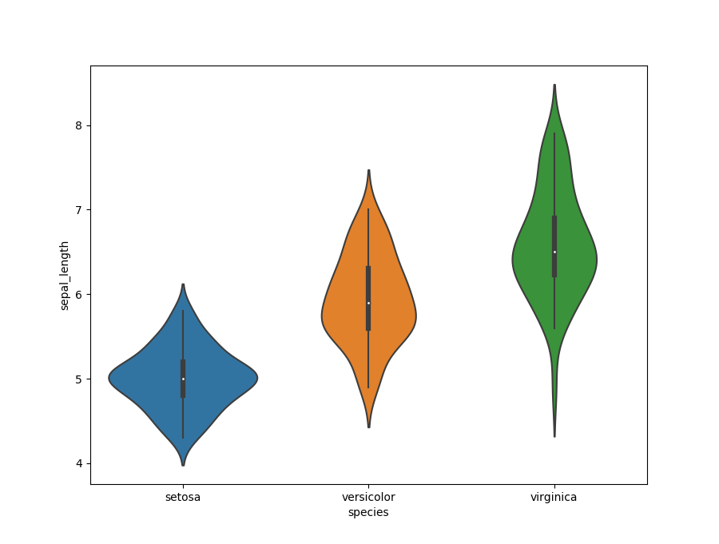
   ```python
   #petal width violin plot
   fig, ax = plt.subplots(figsize =(9, 7)) 
   sns.violinplot(ax = ax, x = dataset["species"],y = dataset["petal_width"] ) 
   plt.show()
   ```
  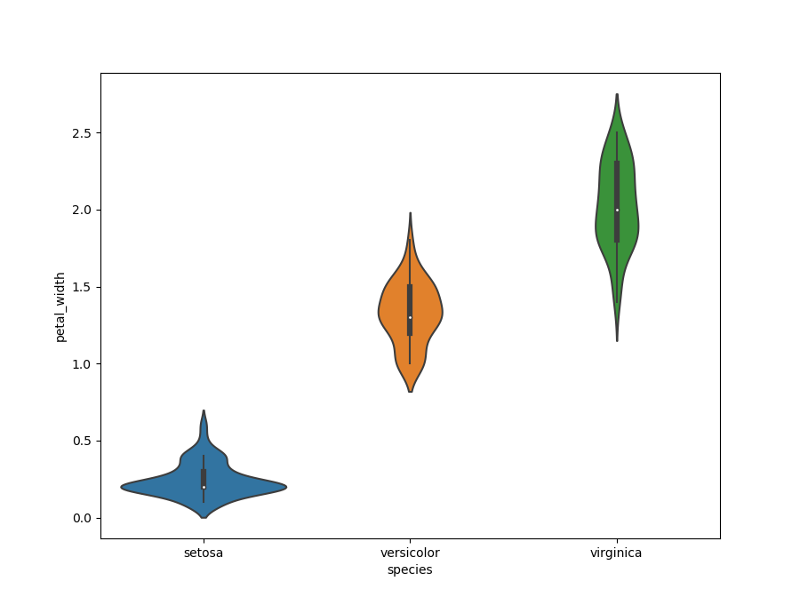
   ```python
   #petal length violin plot
   fig, ax = plt.subplots(figsize =(9, 7)) 
   sns.violinplot(ax = ax, x = dataset["species"],y = dataset["petal_length"] ) 
   plt.show()
  ```

  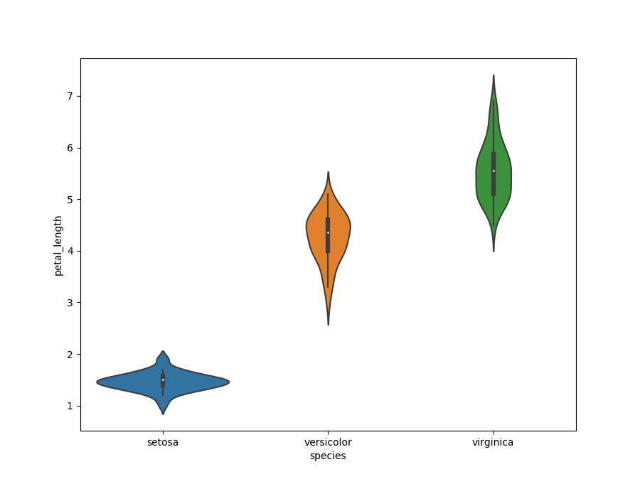

## Pairplot <a name="pair"></a>
   <p align="justify"> Pair Plot is used to view the pairwise relationship between all the variables in a dataset and the diagonal axes show the univariate distribution of the variable. It takes the entire dataset as input and distinguishes data on species with varying colors.</p>
  
   ```python
    sns.pairplot(dataset, hue="species", height=3)
    plt.show()
  
   ```
   
  

## 2D Scatter Graph <a name="scatter"></a>
    
   <p align="justify">A scatter plot/ scatter graph is a two-dimensional data visualization that uses dots to represent the values obtained for two different variables - one plotted along the x-axis and the other plotted along the y-axis.
    scatter graphs are powerful data visualization tools. these are also used to show if there is any connection between groups of data.
    If there is a strong connection or correlation, a ‘line of best fit’ can be drawn.</p>
    

    First 2D scatter graph was drawn of the data set with sepal length and sepal width 

   ```python
   dataset.plot(kind="scatter",x="sepal_length", y="sepal_width")
   plt.show()
   ```
   
   
   ```python
    sns.set_style("whitegrid")
    sns.FacetGrid(dataset,hue="species", height = 4).map(plt.scatter,"sepal_length","sepal_width").add_legend()
    plt.show()
   ```
   
   <p>From the colour coded graph it is clear from the image data of stosa flowers is seprable from others. The setosa sepals are shorter, the versicolor somewhere in the middle and the viriginca flowers generally have longer sepal lengths, but there is a lot of overlap between the versicolor and virginca species. that make it dificult to determine an exact species based on the sepal lengthand width of the flowers.</p>
 

   ```python
    sns.set_style("whitegrid")
    sns.FacetGrid(dataset,hue="species", height = 4).map(plt.scatter,"petal_length","petal_width").add_legend()
    plt.show()
   ```
   

   <p>The colour coded 2d scatter graph of petal width and length shows the same that the data of stosa is clearly seprable. The setosa petal are shorter, the versicolor somewhere in the middle and the viriginca flowers generally have longer petal lengths, and there is little overlap between the versicolor and virginca species. therefore it is easier to determine an exact species based on the petal lengths and width of the flowers.</p>

     
# Conclusion <a name="conclusion"></a>
   -  There is distinct difference in sizes between the species. if look at scatter plot of petal width and petal length across the species. It is clear in graph that the *iris Setosa* have significantly smaller petal width and petal length than the other two species. 
   - This difference is also for the sepal width and Sepal length. if look at scatter plot of sepal width and sepal length across the species. It is clear in graph that the iris Setosa have significantly smaller sepal width and sepal length than the other two species. 
   - These graphs also show that Iris Virginica is the largest species.
   - Colour coded scatter graphs clearly shows that the Iris flowers of setosa species are clearly seprable from other two species. 
   - Classification on base of Petal length and width is much easier as there are less data point overlaps in versicolor and virginica.

<p>This project improve my programming skills and I explore many  new technologies first time like pandas,seaborn and machine learning. During the documentation of this project I face many challanges as markdown is new to me. Overall it was great learning experience and it also made me realize the importance of data analysis. In future my plan is add skilearn and explore some machine learning techniques.</p>

# Reference <a name="Reference"></a>

1. Python Pandas read_csv – Load Data from CSV Files:[https://www.shanelynn.ie/python-pandas-read_csv-load-data-from-csv-files/]
2. Iris datset-Exploratory Data Analysis[https://www.kaggle.com/lalitharajesh/iris-dataset-exploratory-data-analysis]
3. Iris Data Visualization: [https://www.kaggle.com/kstaud85/iris-data-visualization]
4. Scatter graphs [https://www.bbc.com/bitesize/guides/zmt9q6f/revision/1]
5. Visualize Iris dataset using Python [http://www.learn4master.com/machine-learning/visualize-iris-dataset-using-python]
6. Python Histogram : [https://realpython.com/python-histograms/]
7. Boxplot: [https://python-graph-gallery.com/boxplot/]
8. Collapsable text:[https://gist.github.com/joyrexus/16041f2426450e73f5df9391f7f7ae5f]
9. Create Table of Contents:[https://stackoverflow.com/questions/11948245/markdown-to-create-pages-and-table-of-contents]
